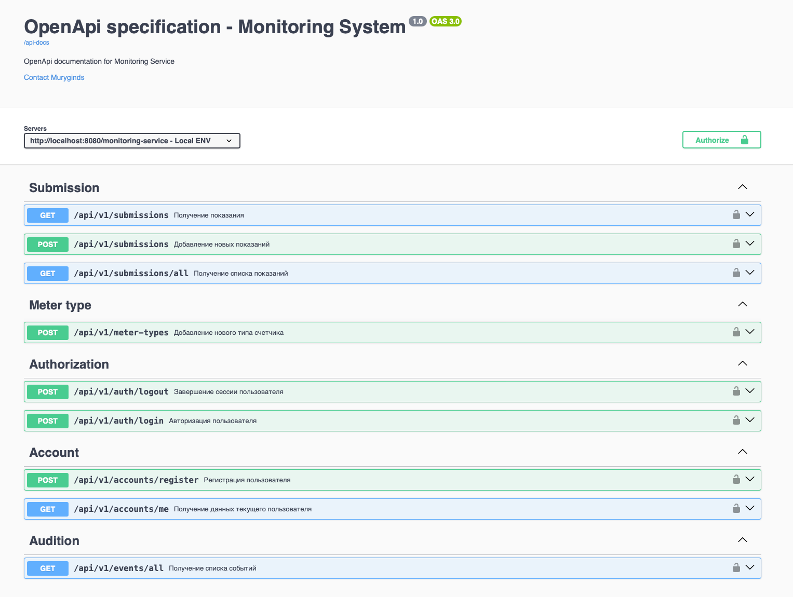

## Meter monitoring service

#### Monitoring Service Console Application
Is a simple Java-based program designed to manage and monitor various aspects related to meter readings and user submissions. The application offers different user interfaces for both regular and administrative users, allowing them to perform tasks such as submitting readings, accessing submission history, and managing meter types.

#### Key Features
User Authentication: Users can register, log in, and log out, ensuring secure access to the
system. Submission Management: Users can submit meter readings, view their submission history,
and retrieve specific submissions by date. Administrative Actions: Administrators have additional features,
including adding new meter types, accessing audition event history, and retrieving submission information for
specific users.

#### Sprints:
- <a href ="https://github.com/Muryginds/ylab-01.2024/pull/3"> sprint 1</a> Entities, in-memory collections, console interface, javadoc, service tests
- <a href ="https://github.com/Muryginds/ylab-01.2024/pull/4"> sprint 2</a> Docker + postgres, liquibase migrations, repository tests
- <a href ="https://github.com/Muryginds/ylab-01.2024/pull/5"> sprint 3</a> Servlets + tomcat, jackson, validations, aspects, logging
- <a href ="https://github.com/Muryginds/ylab-01.2024/pull/6"> sprint 4</a> Spring core + controllers, jwt auth, rest template, open api + swagger

#### API
```

```

#### Testing
    By default, added user 'admin' with password 'admin' and administrative role

    to run tests, add -Denv=test

### Run the Project:

- Clone the repository
- Open a terminal or command prompt.
- Navigate to your project directory.
- Run the following command to execute your application:

#### On Unix-like systems:

```bash
./gradlew clean war
docker compose up -d
```
#### On Windows:

```bash
gradlew.bat clean war
docker compose up -d
```
The Gradle wrapper will download the specified Gradle distribution, compile and run your Java application.
You need to have docker installed